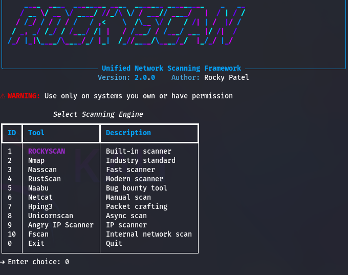

# 🚀 RockyScan

RockyScan is a **unified, interactive Linux CLI network scanning framework** that combines a built-in Python port scanner with wrappers for popular security tools like Nmap, Masscan, Naabu, and more — all accessible from a single interface.

---

## ✨ Features

- 🎛 Interactive menu-based Linux CLI
- 🧠 Built-in Python port scanner (RockyScan Engine)
- 🔗 Wrapper for popular tools:
  - Nmap
  - Masscan
  - RustScan
  - Naabu
  - Netcat
  - Hping3
  - Unicornscan
  - Angry IP Scanner
  - Fscan
- 🐧 Works on Kali Linux & other Linux distros

---

## 📸 Screenshot



> Screenshot showing the RockyScan banner and interactive menu.

---

## 📦 Installation (Recommended – Normal Linux CLI)

This method allows using `rockyscan` **without activating any virtual environment**.

### 🔹How to Install and run
```bash
sudo apt update
git clone git clone https://github.com/cyberrockyroom/RockyScan.git
cd RockyScan
sudo apt install pipx -y
pipx ensurepath
rockyscan
